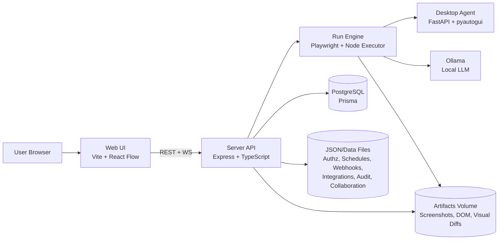
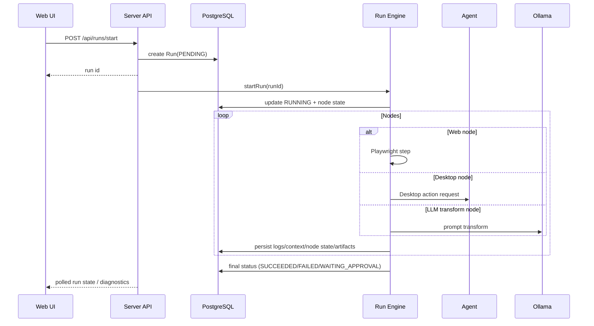

# ForgeFlow Architecture

## 1. System Overview

ForgeFlow is a local-first automation platform with a browser UI, an orchestration API, and an optional desktop agent.

## 2. Components

### `apps/web`
- React + Vite single-page app.
- Node graph editor, run controls, diagnostics panel, templates, schedules, integrations, admin views.
- Uses JWT (`Authorization: Bearer <token>`) for API and query token for collaboration WebSocket.

### `apps/server`
- Express API and orchestration control plane.
- Owns authentication, authorization, workflow CRUD/versioning, schedule management, run lifecycle, secrets, webhooks, metrics, and audit logging.
- Includes Autopilot planner (`/api/autopilot/plan`) and activity catalog (`/api/activities`) for low-code generation workflows.
- Exposes:
  - HTTP API (`/api/*`)
  - health/readiness (`/health`, `/ready`)
  - Prometheus metrics (`/metrics`)
  - WebSocket endpoint (`/ws`) for recorder and collaboration channels.

### `apps/agent`
- FastAPI service for desktop automation/recording actions.
- Invoked by runner desktop node types.
- Requires X11 forwarding on Linux hosts (`DISPLAY` + X authorization).

### Storage
- PostgreSQL (Prisma models): `Workflow`, `WorkflowVersion`, `Run`, `Secret`.
- File-backed stores under `apps/server/data/` (or env override):
  - `AUTHZ_FILE`
  - `SCHEDULES_FILE`
  - `WEBHOOKS_FILE`
  - `AUDIT_FILE`
  - `COLLAB_FILE`
  - `INTEGRATIONS_FILE`
- Artifact directory (`/app/artifacts`) for screenshots/DOM snapshots/visual-diff outputs.

## 3. Core Runtime Flows

### Manual/Test Workflow Run

### Scheduled Run
1. Scheduler loads enabled schedules from schedule store.
2. Cron trigger checks dependency/maintenance-window constraints.
3. Scheduler creates run and calls the same run engine path.
4. Run status and metrics are persisted exactly like manual runs.

### Autopilot Draft Generation
1. User submits prompt in UI (`Autopilot` sidebar section).
2. API builds a deterministic draft definition from recognized intents (web, scraping, API, AI, approvals).
3. UI creates workflow with returned definition and opens it for editing.
4. User refines generated nodes in inspector before publish/run.

### Approval Gate
1. `manual_approval` node pauses run with `WAITING_APPROVAL`.
2. UI calls `POST /api/runs/:id/approve`.
3. If approved, engine resumes from checkpoint.
4. If rejected, run transitions to `FAILED`.

## 4. Security Model

- Authentication: local username/password with JWT issuance.
- Optional TOTP 2FA: setup/verify/disable endpoints.
- Authorization: role + permission checks per endpoint (`requirePermission`).
- Secret handling:
  - Secrets encrypted at rest in DB (`Secret` model).
  - Runtime interpolation syntax: `{{secret:KEY}}`.
- API protection:
  - Global API rate limiting on `/api/*`.
  - Separate stricter login rate limit.
- Audit logging:
  - Security and operational actions appended to persistent audit store.

## 5. Reliability and Observability

- Health probes:
  - `/health` returns dependency and runtime status.
  - `/ready` gates readiness (scheduler + dependency health + non-shutdown state).
- Graceful shutdown:
  - SIGINT/SIGTERM handling
  - Stops scheduler
  - Waits for active runs up to timeout.
- Metrics:
  - Prometheus text endpoint at `/metrics`.
  - Includes request metrics, run counters, process resource metrics, and active-run gauges.
- Structured logs:
  - Request ID propagated in `x-request-id`.
  - JSON logs for request and lifecycle events.

## 6. Extension Points

- New node types: add execution handlers in `apps/server/src/lib/runner.ts`.
- Additional integrations: extend `integrationStore` type + connection test logic.
- Webhook events: extend webhook event catalog and dispatch points.
- New permissions: add role permission mappings and guard endpoints with `requirePermission`.

## 7. Current Constraints

- Desktop automation is Linux/X11 dependent in containerized local mode.
- File-backed config stores are suitable for local/small deployments; for larger setups, migrate these stores to DB-backed models.
- Web and server currently run in dev-oriented container commands by default; production images/process managers should be used in hardened deployments.
